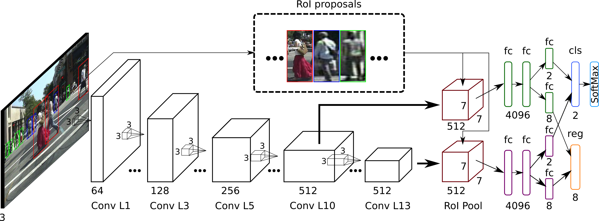

# Pedestrian detector for Lua/Torch7

Train/test/benchmark a pedestrian detector using lua/torch7. These detector uses a modified [Fast R-CNN](https://github.com/rbgirshick/fast-rcnn) network + a pedestrian oriented roi proposal generator for detection.

<p align="center"></p>

The available networks for feature extraction for use are the following:

- AlexNet
- ZeilerNet
- VGG16/19
- Googlenet (inception v3)
- ResNet (18, 32, 50, 101, 152, 200)

> Note: Some of these networks require GPUs with 10Gb+ ram to be trained.

For Region-of-Interest (ROI) proposal generation, this code has three methods for roi proposal generation:

- ACF ([paper](https://pdollar.github.io/files/papers/DollarPAMI14pyramids.pdf), [code](https://github.com/pdollar/toolbox))
- LDCF ([paper](https://pdollar.github.io/files/papers/NamNIPS14ldcf.pdf), [code](https://github.com/pdollar/toolbox))
- EdgeBoxes ([paper](https://www.microsoft.com/en-us/research/publication/edge-boxes-locating-object-proposals-from-edges/#), [code](https://github.com/pdollar/edges))


## Installation

### Requirements

To run the code in this repository you'll need the following resources:

- [Torch7](http://torch.ch/docs/getting-started.html)
- [Fast R-CNN module](https://github.com/farrajota/fast-rcnn-torch)
- [dbcollection](https://github.com/farrajota/dbcollection)
- Python (>=2.7 or >=3.5)
- Matlab >= 2012a (for benchmark and roi proposal generation)

### Packages/dependencies installation

To use this example code, some packages are required for it to work: `fastrcnn` and `dbcollection`.


#### fastrcnn

To install the Fast R-CNN package do the following:

- install all the necessary dependencies.

```bash
luarocks install tds
luarocks install cudnn
luarocks install inn
luarocks install matio
luarocks install torchnet
```

- download and install the package.

```bash
git clone https://github.com/farrajota/fast-rcnn-torch
cd fast-rcnn-torch && luarocks make rocks/*
```

> For more information about the fastrcnn package see [here](https://github.com/farrajota/fast-rcnn-torch).


#### dbcollection

To install the dbcollection package do the following:

- install the Python module (Python>=2.7 and >=3.5).

    ```
    pip install dbcollection==0.1.7
    ```

    or

    ```
    conda install -c farrajota dbcollection==0.1.7
    ```

- install the Lua/Torch7 dbcollection wrapper:

    1. download the Lua/Torch7 git repo to disk.

    ```
    git clone https://github.com/dbcollection/dbcollection-torch7
    ```

    2. install the package.
    ```
    cd dbcollection-torch7 && luarocks make
    ```

> For more information about the dbcollection package see [here](https://github.com/dbcollection/dbcollection-torch7).

# Getting started

## Usage

To start using the code, clone this repo to your home directory:

```
git clone --recursive https://github.com/farrajota/pedestrian_detector_torch
```

If you clone the repo into a different directory, please make sure you modify `projectdir.lua` and point to the new path before using the code.

### Data setup

The necessary data is available for download by calling the following command in the terminal:

```bash
th download/download_all.lua
```

This will download the following data:

- pre-trained models on Imagenet
- pre-processed roi proposals on the caltech pedestrian dataset
- algorithm scores of several methods for benchmark


> Note: this data can also be downloaded manually by following the next steps.


### Download pre-trained models and benchmark algorithm results

Several pre-trained models are available to be used in this code. To download all networks, simply run the following command in the terminal:

```bash
th download/download_pretrained_models.lua
```

For benchmark, other evaluation algorithms need to be downloaded before proceeding to evaluate the trained network. To download all available algorithms simply do the following:

```bash
th download/download_extract_algorithms.lua
```


### RoI Proposals

To generate region proposals, run `th generate_rois.lua` on the terminal. This will automatically generate the RoI proposals needed for training and testing the pedestrian detector.

> Warning: processing the region proposals takes around a week to process. For this reason, pre-processed proposals are available for download:

```bash
th download/download_proposals.lua
```

### Dataset

To run the code, first it is necessary to setup the dataset's data.
This code uses the `dbcollection` package for data setup/management.

To setup a dataset do the following:

```lua
dbc = require 'dbcollection'
caltech = dbc.load{name='caltech_pedestrian',
                   data_dir='save/files/to/dir'}
```

This will download and pre-process the dataset's data and store the all files to the selected path. If `data_dir` is not defined or left empty, the data files will be stored in the `dbcollection/` folder in your home directory in a folder with the dataset's name.

In case you already have the necessary data files, you can manually set the directory path of the files by doing the following commands:

```lua
dbc = require 'dbcollection'
caltech = dbc.load{name='caltech_pedestrian',
                   data_dir='path/to/dataset/files'}
```

> Note: All datasets used here can be downloaded via `dbcollection`.


To download and extract the relevant data, please run the following scripts: `th download_extract_dataset.lua -save_dir <store_dir_path>` and `download_extract_algorithms.lua -save_dir <store_dir_path>`. The `-save_dir <store_dir_path>` allows for the user to save the downloaded data into another directory than the root dir of the code.


#### Available datasets

The following datasets are available for training/testing a pedestrian detector using this repo:

- [Caltech Pedestrian Dataset](http://www.vision.caltech.edu/Image_Datasets/CaltechPedestrians/)


## Train and test a model using the example code

This repository contains scripts for training and testing a pedestrian detector network using a pre-trained network on ImageNet for feature extraction such as the alexnet or vgg.

> Note: several options are available for configuring the training/testing parameters (see `options.lua` for a complete set of available parameters).


### Training a network

To train a model run `th train.lua`. To change the default settings, use the input arguments of your choice. To see all available option's parameters do `th train.lua --help` or check `options.lua`.

* You can select one of the following imagenet pre-trained networks for feature extraction: AlexNet, ZeilerNet, VGG (16, 19), ResNet (19, 34, 50, 101, 152, 200), and GoogleNet v3.

* Snapshots of the network's training procedure are stored to disk other information such as the configuration file, loss logs and model parameters of the training procedure (default path is `./data/exp`). You can change this directory by passing the `-expDir`new path to save the experiment option.


### Testing a network (mAP accuracy)

To test a network's accuracy, run `th test.lua` and define the `-expID`, `-dataset` and `-expDir` input options (if changed) to compute the mean average-precision.

> Note: The test script only uses a single GPU.


### Demo: detecting persons

To run the basic demo code you'll first need to train a network model. After this is done, just simply run the demo on the terminal:

```lua
qlua demo.lua -expID <exp_name>
```

This selects random images from the testing set and it should give you a glimpse of how the net performs.


### Benchmark evaluation

This repo contains scripts for benchmarking the results of your network against other top-performing methods on the Caltech dataset. This requires that evaluation results of other algorithms have been downloaded in order to run.

After this is setup, simply run `th benchmark.lua -expID '<exp_name>` and this will generate a series of plots which are stored in the experiment's folder in `./data/`.

The default name for the method is `OURS`. To change to any other name just set a different name using `-eval_plot_name` input option.


## License

MIT license (see the [LICENSE](LICENSE.md) file)


## Acknowledgements

The evaluation/benchmarking code is an adaptation of @pdollar [toolbox](https://github.com/pdollar/toolbox)/[evaluation](http://www.vision.caltech.edu/Image_Datasets/CaltechPedestrians/code/code3.2.1.zip) code.